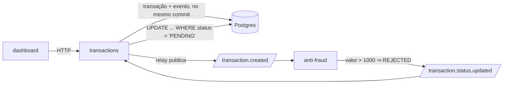

# Transações com validação antifraude

API de transações financeiras em que cada transação nasce `PENDING`, é avaliada de forma assíncrona
por um serviço antifraude via Kafka e tem o status atualizado depois — com um dashboard que reflete
essa mudança sem o usuário recarregar a página.

Solução para o [desafio técnico da BIUD](./docs/desafio.md). As decisões estão em [DECISIONS.md](./DECISIONS.md); as práticas de processo, em [PRACTICES.md](./PRACTICES.md).

- [Como rodar](#como-rodar)
- [O que foi construído](#o-que-foi-construído)
- [API](#api)
- [Dashboard](#dashboard)
- [Como testar](#como-testar)

- [O que ficou de fora](#o-que-ficou-de-fora)

## Como rodar

Pré-requisitos: Node 22.23+ (`nvm install` lê o `.nvmrc`), pnpm 11, Docker com o plugin `compose`.

```bash
cp .env.example .env     # antes do install: o postinstall gera o client do Prisma
docker compose up -d     # 5432 ocupada? ajuste POSTGRES_PORT e DATABASE_URL no .env
pnpm install
pnpm db:migrate
pnpm dev                 # transactions :3001, anti-fraud :3002, dashboard :3000
```

O Kafka UI fica em <http://localhost:8080>.

## O que foi construído



| Peça                 | Responsabilidade                                                                      |
| -------------------- | ------------------------------------------------------------------------------------- |
| `apps/transactions`  | API de criação, consulta e listagem; publica o evento de criação e consome o veredito |
| `apps/anti-fraud`    | Consome o evento de criação, aplica a regra e publica o veredito. Não tem banco       |
| `apps/web`           | Dashboard: listagem com filtros, detalhe, criação e cards de resumo                   |
| `packages/contracts` | Schemas dos corpos, das respostas e dos eventos, usados pelos três                    |
| `packages/messaging` | Producer, consumidor com retry e DLQ, e criação dos tópicos no boot                   |

O que o desenho garante, e os testes cobrem:

- **Nenhum evento se perde.** A transação e o evento são gravados no mesmo commit, então a API
  continua respondendo `201` com o Kafka fora do ar, e a fila drena quando ele volta.
- **Nenhuma mensagem trava a fila.** JSON inválido, payload fora do contrato ou handler que falha
  repetidamente vão para `<tópico>.dlq`, com o motivo nos headers.
- **Entrega repetida é inofensiva.** O veredito só é aplicado se a transação ainda estiver pendente.
- **Dá para seguir uma requisição inteira.** O `x-request-id` da chamada viaja no evento e aparece
  nos logs dos dois serviços.

## API

Base: `http://localhost:3001`.

| Método | Rota                                   | Descrição                                            |
| ------ | -------------------------------------- | ---------------------------------------------------- |
| `POST` | `/transactions`                        | Cria a transação como `PENDING`                      |
| `GET`  | `/transactions`                        | Listagem paginada, com filtros                       |
| `GET`  | `/transactions/stats`                  | Totais por status e volume aprovado                  |
| `GET`  | `/transactions/:transactionExternalId` | Detalhe de uma transação                             |
| `GET`  | `/transaction-types`                   | Catálogo de tipos                                    |
| `GET`  | `/health`                              | Reporta banco e consumidor; `degraded` se algum cair |

Filtros da listagem: `status`, `transferTypeId`, `from` e `to` (datas `AAAA-MM-DD`, inclusivas nas
duas pontas, em UTC), `page` e `pageSize` (padrão 20, máximo 100).

```bash
curl -X POST http://localhost:3001/transactions \
  -H 'content-type: application/json' \
  -d '{"accountExternalIdDebit":"3fa85f64-5717-4562-b3fc-2c963f66afa6",
       "accountExternalIdCredit":"3fa85f64-5717-4562-b3fc-2c963f66afa7",
       "transferTypeId":1,"value":120}'
```

Erros vêm sempre como `{ statusCode, message, errors? }`, com um item por campo na validação.

## Dashboard

Uma tela, em <http://localhost:3000>: a listagem, com filtros, paginação e cards de resumo. O
detalhe abre num painel lateral e a criação num diálogo, os dois por cima da listagem e com rota
própria — `/transactions/:id` e `/transactions/new` são links compartilháveis. Carregando, erro e
lista vazia são tratados explicitamente.

A transação criada aparece como pendente e muda de status sozinha, sem recarregar.

## Como testar

```bash
pnpm quality   # o gate inteiro: lint, formatação, typecheck, testes e build
pnpm smoke     # fluxo real ponta a ponta, com a stack de pé
```

`pnpm quality` é o mesmo comando que a integração contínua roda, com um Postgres como service
container. Os testes de integração sobem a aplicação inteira contra o Postgres do compose, num schema
isolado — por isso o compose precisa estar de pé. O `pnpm smoke` cria transações de 120, 1500 e 1000
e espera os vereditos, que é o único caminho que exercita o Kafka de verdade.

Etapas isoladas: `pnpm lint`, `pnpm format`, `pnpm typecheck`, `pnpm test`, `pnpm build`. Por pacote,
`pnpm --filter @challenge/web test:watch`.

O `typecheck` roda com o TypeScript estrito, incluindo `noUncheckedIndexedAccess`, e o lint usa as
regras que dependem de tipo. Parte disso roda antes do commit: o `pre-commit` linta e formata o que
está staged e confere o nome da branch; o `commit-msg` valida a mensagem contra o Conventional
Commits.

## O que ficou de fora

- **Autenticação** — A API aceita chamadas da origem do dashboard, via CORS.
- **Chave de idempotência no `POST`** — sob carga, um retry do cliente cria transação duplicada.
  Está desenhada (`Idempotency-Key` no header, `UNIQUE` no banco) e não implementada.
- **OpenAPI** — os contratos são schemas zod; gerar a especificação a partir deles seria o passo
  seguinte se aparecesse um consumidor externo.
- **Dockerfile das aplicações** — o compose sobe só a infraestrutura; as apps rodam com `pnpm dev`.
- **Kafka na integração contínua** — o gate roda com Postgres real e Kafka substituído por fakes; o
  caminho com Kafka de verdade é o `pnpm smoke`, hoje manual.
- **Métricas e tracing** — só logs estruturados com o `correlationId`.
- **Testes no navegador** — as telas são testadas com Testing Library e MSW; um end-to-end subiria a
  stack inteira por teste.
