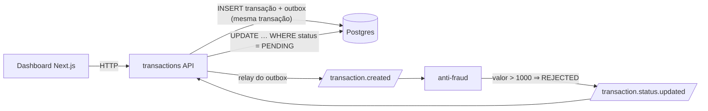

# Transações com validação antifraude

Solução para o [desafio técnico fullstack da BIUD](./docs/desafio.md): uma API de transações
financeiras em que cada transação nasce `pendente`, é avaliada de forma assíncrona por um serviço
antifraude via Kafka e tem o status atualizado depois — e um dashboard que reflete essa mudança
sem o usuário recarregar a página.

As decisões de arquitetura, com alternativas e porquês, estão em [DECISIONS.md](./DECISIONS.md).
As práticas seguidas estão em [PRACTICES.md](./PRACTICES.md).

- [O que foi construído](#o-que-foi-construído)
- [Como rodar](#como-rodar)
- [Como testar](#como-testar)
- [API](#api)
- [Organização do repositório](#organização-do-repositório)
- [Convenções](#convenções)
- [O que ficou de fora](#o-que-ficou-de-fora)

## O que foi construído



| Peça                 | O que faz                                                                                                                                                                                                      |
| -------------------- | -------------------------------------------------------------------------------------------------------------------------------------------------------------------------------------------------------------- |
| `apps/transactions`  | API NestJS: cria (`PENDING` + evento no **outbox transacional**), consulta e lista com filtros/paginação; relay publica o outbox no Kafka; consome o veredito e aplica com um `UPDATE` condicional idempotente |
| `apps/anti-fraud`    | Serviço NestJS stateless: consome `transaction.created`, aplica a regra (acima de `ANTI_FRAUD_VALUE_LIMIT` = 1000 rejeita) e publica `transaction.status.updated` com `causationId`/`correlationId`            |
| `apps/web`           | Dashboard Next.js 16: listagem com filtros na URL e paginação, detalhe, criação com validação — estados de carregamento/erro/vazio explícitos; **polling condicional** enquanto houver transação pendente      |
| `packages/contracts` | Schemas zod dos corpos e respostas da API e dos eventos (envelope versionado), compartilhados por backend e frontend                                                                                           |
| `packages/messaging` | Camada fina sobre o kafkajs: producer, consumer com **validação → retry com backoff → DLQ**, criação idempotente dos tópicos no boot                                                                           |

Garantias que o desenho dá e que os testes cobrem:

- **Nenhum evento se perde**: o evento é gravado na mesma transação de banco da transação; com o
  Kafka fora do ar a API continua respondendo 201 e o outbox drena quando ele volta.
- **Nenhuma mensagem trava a fila**: JSON inválido, payload fora do contrato ou handler que falha
  repetidamente vão para `<tópico>.dlq` com o motivo nos headers.
- **Entrega repetida é inofensiva**: o veredito é aplicado com `UPDATE … WHERE status = 'PENDING'`.
- **Rastreabilidade**: `x-request-id` da requisição vira `correlationId` do evento e do veredito,
  e aparece nos logs dos dois serviços.

## Como rodar

Pré-requisitos: Node.js 22.23+ (`nvm install` lê o `.nvmrc`), pnpm 11 (fixado em `packageManager`;
o pnpm 11 se auto-gerencia), Docker com o plugin `compose`.

> **Já existe um PostgreSQL na sua máquina em `localhost:5432`?** É comum em máquinas de
> desenvolvimento. Os sintomas: o `docker compose up` falha com `address already in use` na porta
> 5432 e, se você seguir adiante, o `pnpm db:migrate` bate no Postgres errado com
> "Authentication failed". Logo depois de copiar o `.env`, edite duas linhas nele:
> `POSTGRES_PORT=5433` e a porta em `DATABASE_URL` (`localhost:5433`). O compose e todos os
> serviços leem daí.

```bash
nvm install                 # Node da versao do .nvmrc
cp .env.example .env        # variaveis do ambiente local (antes do pnpm install)
                            # -> porta 5432 ocupada? ajuste POSTGRES_PORT e DATABASE_URL no .env agora
docker compose up -d        # Postgres :5432 (ou POSTGRES_PORT), Kafka :9092, Kafka UI :8080
pnpm install                # instala, gera o client Prisma e compila os pacotes internos
pnpm db:migrate             # aplica as migrations (schema + catalogo de tipos)
pnpm dev                    # sobe transactions :3001, anti-fraud :3002 e o dashboard :3000
```

| Serviço      | Endereço                              |
| ------------ | ------------------------------------- |
| dashboard    | http://localhost:3000                 |
| transactions | http://localhost:3001/health          |
| anti-fraud   | http://localhost:3002/health          |
| Postgres     | `localhost:5432` (ou `POSTGRES_PORT`) |
| Kafka        | `localhost:9092`                      |
| Kafka UI     | http://localhost:8080                 |

Os dois `/health` fazem _readiness_ de verdade: só respondem 200 com o banco acessível e o
consumer Kafka rodando.

## Como testar

### Quality gate

Um único comando roda tudo que valida o projeto — o mesmo que a integração contínua executa a
cada push e pull request:

```bash
pnpm quality
```

| Comando             | O que faz                                                                                                                        |
| ------------------- | -------------------------------------------------------------------------------------------------------------------------------- |
| `pnpm bootstrap`    | gera o client Prisma e compila os pacotes internos (`packages/*`); roda no `pnpm install` e antes do lint, que precisa dos tipos |
| `pnpm lint`         | ESLint com regras de checagem de tipos em todo o repositório                                                                     |
| `pnpm format:check` | Prettier em modo verificação (`pnpm format` corrige)                                                                             |
| `pnpm typecheck`    | `tsc --noEmit` em cada pacote (`next typegen` antes, no dashboard)                                                               |
| `pnpm test`         | Vitest em cada pacote — os testes de integração usam o Postgres do compose, num schema `test` isolado                            |
| `pnpm build`        | build de cada pacote, na ordem do grafo                                                                                          |

Antes de cada commit, `lint-staged` roda ESLint e Prettier nos arquivos alterados; `commitlint`
recusa mensagens fora do [Conventional Commits](https://www.conventionalcommits.org/pt-br/v1.0.0/);
um guard recusa commits diretos em `develop` e nomes de branch fora de `<tipo>/<descricao-kebab>`.

> Commita por um cliente gráfico (WebStorm, VS Code) e usa `nvm`? Crie `~/.config/husky/init.sh`
> carregando o nvm para que `pnpm` esteja no `PATH` do hook:
>
> ```sh
> export NVM_DIR="$HOME/.nvm"
> [ -s "$NVM_DIR/nvm.sh" ] && . "$NVM_DIR/nvm.sh"
> ```

### O que os testes cobrem

- **contracts**: aceitação e rejeição dos schemas (limites de valor, UUIDs, período invertido,
  paginação) e a consistência dos envelopes de evento.
- **messaging**: a política do consumer (inválido → DLQ; falha → retry com backoff e `heartbeat`
  → DLQ com headers; sucesso na segunda tentativa), o producer e a criação de tópicos.
- **transactions**: unitários (regras, mapeamentos, classificação de erros) e **integração
  contra o Postgres real** — criação com atomicidade do outbox, filtros/período/paginação da
  listagem, formato de erro, relay (claims concorrentes não publicam em dobro, falha por evento,
  claim abandonado expira), transições de status e idempotência.
- **anti-fraud**: a regra nos limites (1000 aprova, 1000.01 rejeita), o veredito encadeado ao
  evento de origem, o contrato publisher↔consumer e o wiring dos módulos.
- **web**: cada tela com Testing Library + MSW, consultando por papel acessível — carregamento,
  erro com "tentar novamente", vazio, filtros e paginação na URL, polling que para quando tudo é
  final, formulário com erros por campo e 400 da API levado ao campo.

### Verificação ponta a ponta

Com a infraestrutura e as três aplicações de pé:

```bash
pnpm smoke
```

Cria transações de 120, 1500 e 1000 e espera o veredito chegar ao status (`APPROVED`,
`REJECTED`, `APPROVED`) passando por Postgres, outbox, Kafka e os dois serviços. Fica fora do
quality gate de propósito: exige a stack inteira.

Para ver a resiliência à queda do broker, à mão: `docker compose stop kafka`, crie uma transação
(a API responde 201 e a linha fica em `outbox_events` com `attempts` subindo),
`docker compose start kafka` — o evento sai sozinho e o status é atualizado. Para ver a DLQ:
publique um texto que não é JSON em `transaction.created` pelo Kafka UI; ele aparece em
`transaction.created.dlq` com o motivo nos headers e o consumidor segue vivo.

## API

| Método | Rota                                   | Descrição                                                                                                           |
| ------ | -------------------------------------- | ------------------------------------------------------------------------------------------------------------------- |
| `POST` | `/transactions`                        | cria (`201`, status `PENDING`); `400` com `errors[{ path, message }]`; `422` se o tipo não existe                   |
| `GET`  | `/transactions/:transactionExternalId` | detalhe (`404` se não existe; `400` se não é UUID)                                                                  |
| `GET`  | `/transactions`                        | lista paginada: `status`, `transferTypeId`, `from`/`to` (`AAAA-MM-DD`, inclusivos, UTC), `page`, `pageSize` (≤ 100) |
| `GET`  | `/transaction-types`                   | catálogo de tipos (semeado pela migration: TED, PIX, DOC)                                                           |
| `GET`  | `/health`                              | readiness (`database`, `kafka`)                                                                                     |

```bash
curl -s -X POST localhost:3001/transactions -H 'content-type: application/json' \
  -d '{"accountExternalIdDebit":"3f2b1d3e-8c4a-4f6e-9a1b-2c3d4e5f6a7b","accountExternalIdCredit":"9a8b7c6d-5e4f-4a3b-8c2d-1e0f9a8b7c6d","transferTypeId":1,"value":120}'
```

Toda resposta de erro tem a forma `{ statusCode, message, errors? }`; banco inacessível responde
`503`. O header `x-request-id` (enviado ou gerado) volta na resposta e correlaciona os eventos.

Eventos (`packages/contracts`): envelope
`{ eventId, eventType, version, occurredAt, correlationId, causationId?, data }`, chave da
mensagem = id da transação, tópicos `transaction.created` e `transaction.status.updated`, cada um
com `<tópico>.dlq`.

## Organização do repositório

```
apps/transactions     API NestJS de transacoes (Prisma + Postgres); migrations em prisma/migrations
apps/anti-fraud       servico NestJS que avalia cada transacao criada e publica o veredito
apps/web              dashboard Next.js (App Router, Tailwind, TanStack Query)
packages/contracts    schemas zod da API e dos eventos, compartilhados por backend e frontend
packages/messaging    camada fina sobre o kafkajs: producer, consumer com retry/DLQ, topicos no boot
scripts/smoke.ts      verificacao ponta a ponta (pnpm smoke)
docs/desafio.md       enunciado original do desafio
```

Monorepo com pnpm workspaces e Turborepo; um `.env` na raiz para tudo (`.env.example` documenta
cada variável).

## Convenções

- Branches saem de `develop` com o tipo do commit no nome: `feat/criacao-de-transacao`.
- Commits pequenos, no padrão Conventional Commits: `feat(transactions): adiciona endpoint de criacao`.
- Todo trabalho entra por pull request para `develop`, com o template preenchido; `develop` exige
  o check `quality` verde (inclusive para administradores).

## O que ficou de fora

- **Autenticação e autorização** — o enunciado não pede; o dashboard fala com a API sem
  credenciais e o CORS aceita só `WEB_ORIGIN`.
- **Documentação OpenAPI/Swagger** — os contratos vivem como schemas zod; gerar OpenAPI a partir
  deles seria o próximo passo se houvesse consumidores externos.
- **Imagens Docker das aplicações** — o compose sobe só a infraestrutura; as apps rodam com
  `pnpm dev`. Um `Dockerfile` por app com build multi-stage é trabalho mecânico que não muda o
  desenho.
- **Kafka no CI** — o gate roda com Postgres real e Kafka substituído por fakes; o caminho Kafka
  de verdade é o `pnpm smoke`. Um service container de Kafka no GitHub Actions tornaria o smoke
  automático.
- **Observabilidade além de logs estruturados** — sem métricas nem tracing; o `correlationId`
  nos logs é o mínimo para seguir uma requisição. Lag do consumer e backlog do outbox são as
  primeiras métricas que eu exporia (ver a resposta sobre concorrência em `DECISIONS.md`).
- **Chave de idempotência no `POST`** — retries do cliente podem criar duplicatas; está desenhado
  (`Idempotency-Key` + `UNIQUE`) e não implementado.
- **Testes end-to-end no navegador** (Playwright) — as telas são testadas com Testing Library e
  MSW; um E2E de verdade subiria a stack inteira por teste.
- **`root-env-file.ts` e `nest-messaging-logger.ts` duplicados** entre os dois serviços — quinze
  linhas cada; um pacote só para isso custaria mais do que a duplicação.
