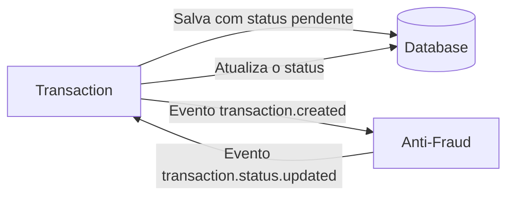

# Desafio Técnico BIUD — Fullstack

Bem-vindo. Este desafio existe para que você mostre como pensa, decide e organiza código em
um cenário próximo do que fazemos aqui: uma API orientada a eventos e uma interface que
precisa lidar com dados que mudam depois que a tela já foi renderizada.

O repositório vem praticamente vazio de propósito. Montar o projeto — workspace, tooling,
padrões, integração contínua — faz parte do desafio, porque faz parte do trabalho.

Leia o [PRACTICES.md](./PRACTICES.md) antes de começar: o que está lá são requisitos, não
sugestões.

- [O problema](#o-problema)
- [Contratos](#contratos)
- [O que você precisa entregar](#o-que-você-precisa-entregar)
- [O que já vem no repositório](#o-que-já-vem-no-repositório)
- [Stack](#stack)
- [Subindo a infraestrutura](#subindo-a-infraestrutura)
- [Defesa do código](#defesa-do-código)
- [Como entregar](#como-entregar)

---

## O problema

Toda transação financeira criada precisa ser validada por um microserviço antifraude. Esse
serviço avalia a transação e devolve o resultado, que atualiza o status do registro
original.

Uma transação tem três status possíveis: **pendente**, **aprovada** e **rejeitada**. Toda
transação com valor **acima de 1000** deve ser rejeitada; as demais são aprovadas.



A comunicação entre os dois serviços é feita por **Kafka**. A chamada de criação não pode
esperar o resultado da validação: a transação nasce `pendente` e muda de status depois, de
forma assíncrona.

## Contratos

### Criar uma transação

```json
{
  "accountExternalIdDebit": "Guid",
  "accountExternalIdCredit": "Guid",
  "transferTypeId": 1,
  "value": 120
}
```

### Recuperar uma transação

```json
{
  "transactionExternalId": "Guid",
  "transactionType": { "name": "" },
  "transactionStatus": { "name": "" },
  "value": 120,
  "createdAt": "Date"
}
```

### Eventos

Estes são os dois eventos do fluxo. O formato do payload é decisão sua — só precisa ser
consistente entre quem publica e quem consome.

| Evento | Publicado por | Consumido por |
| --- | --- | --- |
| `transaction.created` | `transactions` | `anti-fraud` |
| `transaction.status.updated` | `anti-fraud` | `transactions` |

## O que você precisa entregar

### Fundação do projeto

Você começa do zero. Espera-se que monte:

- A estrutura do projeto — monorepo ou repositórios separados por serviço, a escolha é sua
- TypeScript configurado
- Lint e formatação, rodando também como hook de pre-commit
- Validação de mensagem de commit (Conventional Commits)
- Um comando único que roda todo o quality gate
- Integração contínua no GitHub Actions, executando esse mesmo quality gate e **verde ao final**

O [PRACTICES.md](./PRACTICES.md) detalha o que cada um desses itens precisa cobrir.

### Backend

- Endpoint de criação de transação, gravando com status `pendente` e publicando o evento de criação
- Endpoint de consulta de uma transação pelo identificador externo
- Endpoint de listagem paginada, com filtros por status, tipo e período — é o que alimenta o dashboard
- Serviço antifraude consumindo o evento de criação, aplicando a regra e publicando o resultado
- Consumo do evento de retorno no serviço de transações, atualizando o status
- Modelagem de dados e migrations versionadas

### Frontend

Um dashboard sobre essa API, com:

- **Listagem** paginada, com filtros por status, tipo e período
- **Detalhe** de uma transação
- **Criação** de transação por formulário, com validação
- **Estados de tela** tratados explicitamente: carregando, erro e lista vazia

Repare que a transação aparece como `pendente` e muda de status fora do ciclo de request do
usuário. Como a interface reflete essa mudança é decisão sua — e queremos ler o porquê dela.

### Testes

Testes automatizados cobrindo as regras de negócio no backend e as telas principais no
frontend.

### DECISIONS.md

Crie um `DECISIONS.md` na raiz. Para **cada decisão estruturante** — organização do projeto,
modelagem de dados, formato dos eventos, tratamento de falha na mensageria, atualização do
status na interface, estratégia de testes — registre:

1. Qual foi a decisão
2. Que alternativas você considerou
3. Por que escolheu essa

Inclua também sua resposta para esta pergunta:

> A aplicação pode precisar lidar com um volume alto de escritas e leituras concorrentes.
> Como você abordaria esse requisito?

Não precisa implementar a resposta — precisa defendê-la.

Uma decisão sem alternativa considerada não é uma decisão, é um acidente. É o **porquê** que
nos interessa.

### README do seu projeto

Substitua este README pelo seu: o que você construiu, como rodar, como testar e o que ficou
de fora. Quem clona o seu repositório precisa conseguir subir tudo sem perguntar nada.

## O que já vem no repositório

Só a infraestrutura local, para que todo mundo desenvolva contra os mesmos serviços:

| Arquivo | Para quê |
| --- | --- |
| `docker-compose.yml` | Postgres, Kafka e Kafka UI |
| `.env.example` | Variáveis de ambiente do ambiente local |
| `.editorconfig`, `.gitignore`, `.nvmrc` | Convenções básicas de editor e versão do Node |
| `.github/pull_request_template.md` | Template de PR |

Todo o resto é seu. Nada aqui é intocável: se sua arquitetura pedir outra coisa, mude — e
registre o porquê no `DECISIONS.md`.

## Stack

O uso desta stack é obrigatório, porque é a que usamos aqui:

| Camada | Tecnologia |
| --- | --- |
| Runtime | Node.js 22+ |
| Gerenciador de pacotes | pnpm |
| Backend | NestJS + TypeScript |
| ORM | Prisma |
| Banco | PostgreSQL |
| Mensageria | Kafka |
| Frontend | Next.js + React + Tailwind |
| Testes | À sua escolha, desde que rodem no quality gate |

Dentro dessa stack, a organização do código é sua: paradigma, camadas, modularização e
estilo ficam a seu critério.

## Subindo a infraestrutura

```bash
cp .env.example .env
docker compose up -d
```

Serviços disponíveis depois disso:

| Serviço | Endereço |
| --- | --- |
| Postgres | `localhost:5432` |
| Kafka | `localhost:9092` |
| Kafka UI | http://localhost:8080 |

As portas das suas aplicações ficam a seu critério; o `.env.example` sugere 3001 para a API
de transações, 3002 para o antifraude e 3000 para o dashboard.

## Defesa do código

Depois da entrega, conversamos sobre o código. Você vai percorrer as escolhas do
`DECISIONS.md`, explicar por que cada uma foi feita e o que mudaria com outros requisitos.

Usar IA no dia a dia é normal e aqui também é — não é isso que estamos medindo. O que
avaliamos é se você entende, sustenta e consegue mudar aquilo que entregou. Código que você
não sabe explicar não conta a seu favor, tenha vindo de onde tiver vindo.

## Como entregar

1. Faça um **fork** deste repositório
2. Desenvolva no seu fork, com commits incrementais, seguindo o [PRACTICES.md](./PRACTICES.md)
3. Compartilhe o fork com os avaliadores, em **Settings → Collaborators**:

   - alex.silveira@biud.com.br
   - marcelo.oliveira@biud.com.br
   - gustavofarias@biud.com.br

4. Avise a conclusão por e-mail dentro do prazo de **5 dias corridos**

Ficou alguma dúvida sobre o enunciado? Pergunte — tirar dúvida faz parte do processo e não
conta contra você.

Boa sorte.
